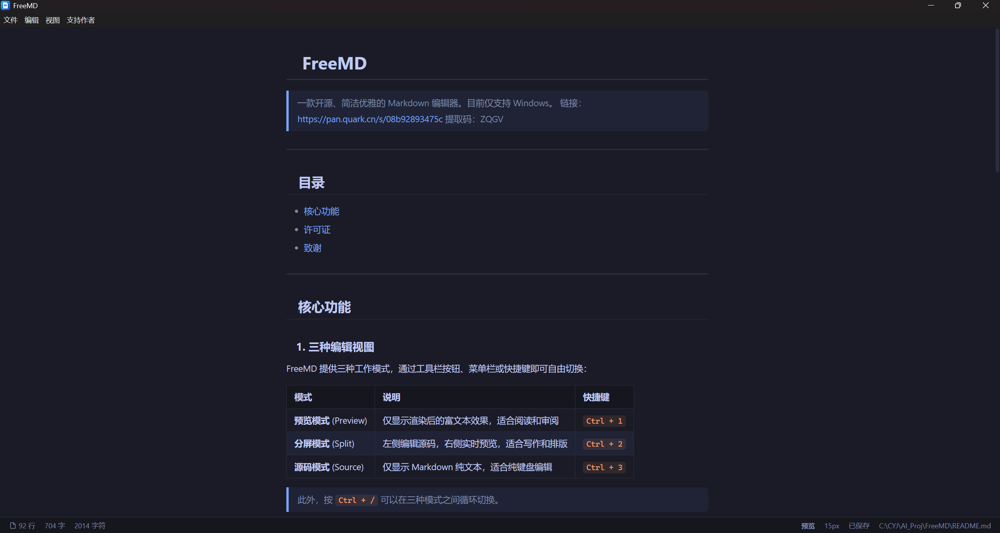

# FreeMD

> 一款开源、简洁优雅的 Markdown 编辑器。目前仅支持 Windows。
链接：https://pan.quark.cn/s/330dd862a051
提取码：92ij

---

## 目录

- [核心功能](#核心功能)
- [许可证](#许可证)
- [致谢](#致谢)

---

## 核心功能

### 1. 三种编辑视图

FreeMD 提供三种工作模式，通过工具栏按钮、菜单栏或快捷键即可自由切换：

| 模式 | 说明 | 快捷键 |
|------|------|--------|
| **预览模式** (Preview) | 仅显示渲染后的富文本效果，适合阅读和审阅 | `Ctrl + 1` |
| **分屏模式** (Split) | 左侧编辑源码，右侧实时预览，适合写作和排版 | `Ctrl + 2` |
| **源码模式** (Source) | 仅显示 Markdown 纯文本，适合纯键盘编辑 | `Ctrl + 3` |

> 此外，按 `Ctrl + /` 可以在三种模式之间循环切换。

### 2. 深色 / 浅色主题

支持三种主题模式，可通过工具栏按钮或菜单栏切换：

| 模式 | 说明 | 菜单路径 |
|------|------|----------|
| **跟随系统** (Auto) | 自动跟随操作系统的明暗主题设置（默认） | 视图 → 切换主题 → 跟随系统 |
| **浅色** (Light) | 浅色背景，适合日间使用 | 视图 → 切换主题 → 浅色 |
| **深色** (Dark) | 深色背景，护眼舒适，适合夜间或编程 | 视图 → 切换主题 → 深色 |

工具栏右侧的主题按钮也可以快速切换当前主题（浅色 ↔ 深色）。

### 3. 导出功能

| 导出格式 | 说明 | 快捷键 |
|----------|------|--------|
| **PDF** | 将 Markdown 内容渲染后导出为 A4 大小的 PDF 文件 | `Ctrl + Shift + P` |
| **HTML** | 导出为包含完整样式和数学公式渲染的自包含 HTML 文件 | `Ctrl + Shift + H` |

两种导出均保留完整的排版样式、代码高亮、数学公式和表格。HTML 导出的 KaTeX 字体通过 CDN 加载，可独立在任何浏览器中正常显示。PDF 导出使用 Chromium 原生打印引擎，支持自定义页边距和背景色。

### 4. 快捷键

| 快捷键 | 功能 |
|--------|------|
| `Ctrl + N` | 新建文件 |
| `Ctrl + O` | 打开文件 |
| `Ctrl + S` | 保存 |
| `Ctrl + Shift + S` | 另存为 |
| `Ctrl + Shift + P` | 导出 PDF |
| `Ctrl + Shift + H` | 导出 HTML |
| `Ctrl + Q` | 退出应用 |
| `Ctrl + 1` | 预览模式 |
| `Ctrl + 2` | 分屏模式 |
| `Ctrl + 3` | 源码模式 |
| `Ctrl + /` | 循环切换模式 |
| `Ctrl + +` | 增大字号 |
| `Ctrl + -` | 减小字号 |
| `Ctrl + 0` | 重置字号和窗口缩放 |
| `Ctrl + 滚轮` | 缩放整个窗口 |
| `F12` / `Ctrl+Shift+I` | 开发者工具（仅开发模式） |

---

## 许可证

MIT License - 详见 [LICENSE](LICENSE)

Copyright (c) FreeMD Contributors

---

## 致谢

- 由崔玉君开发并开源
- [CodeMirror](https://codemirror.net/) - 强大可扩展的编辑器引擎
- [markdown-it](https://github.com/markdown-it/markdown-it) - 高性能 Markdown 解析器
- [KaTeX](https://katex.org/) - 最快的数学公式渲染库
- [highlight.js](https://highlightjs.org/) - 代码语法高亮库
- [Electron](https://www.electronjs.org/) - 跨平台桌面应用框架
- [Vue.js](https://vuejs.org/) - 渐进式 JavaScript 框架
- [Vite](https://vitejs.dev/) - 下一代前端构建工具
